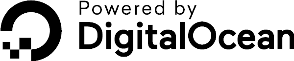

# Public API for Public APIs

So, the [public-apis](https://github.com/toddmotto/public-apis) project is all about collecting public API services from all corners of the internet, yet does not offer its own API... no longer!

This service supports [CORS](https://developer.mozilla.org/en-US/docs/Web/HTTP/CORS) and requires no authentication to use. All responses are sent over HTTPS as well.

Please note that this service is still in beta, so some aspects are subject to change (base URL, documentation, etc).

If you would like to leave feedback or request a feature, please [open an issue](https://github.com/davemachado/public-api/issues). If you would like to contribute, feel free to [open a pull request](https://github.com/davemachado/public-api/pulls).

## Github Project
https://github.com/davemachado/public-api

## Base URL
https://api.publicapis.org/

---

# Services
## **GET** /entries

*List all entries currently cataloged in the project*

### Parameters
Parameter | Type | Data Type | Description | Required
| --- | --- | --- | --- | --- |
| title | query | string | name of entry (matches via substring - i.e. "at" would return "cat" and "atlas") | No |
| description | query | string | description of entry (matches via substring) | No |
| auth | query | string | auth type of entry (can only be values matching in project or null) | No |
| https | query | bool | return entries that support HTTPS or not | No |
| cors | query | string | CORS support for entry ("yes", "no", or "unknown") | No |
| category | query | string | return entries of a specific category | No |

## **GET** /health-check

*ping service to check if it is currently active*

### Parameters
None

---

